


<a href="assets/abdul-rehman-film.mp4">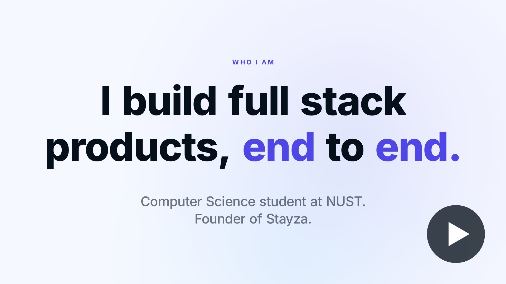</a>

  

<a href="https://stayza.pk"></a>

<a href="https://stayza.pk/founder"></a>

  

<a href="https://github.com/rehmanoncloud9/raabta-ai"></a><a href="https://iamabdulrehman.vercel.app/projects/jarvis-os"></a><a href="https://github.com/rehmanoncloud9/crime-management-system"></a>

<a href="https://github.com/rehmanoncloud9/CarRent"></a><a href="https://github.com/rehmanoncloud9/course-file-organizer"></a>

 


  


  

  

